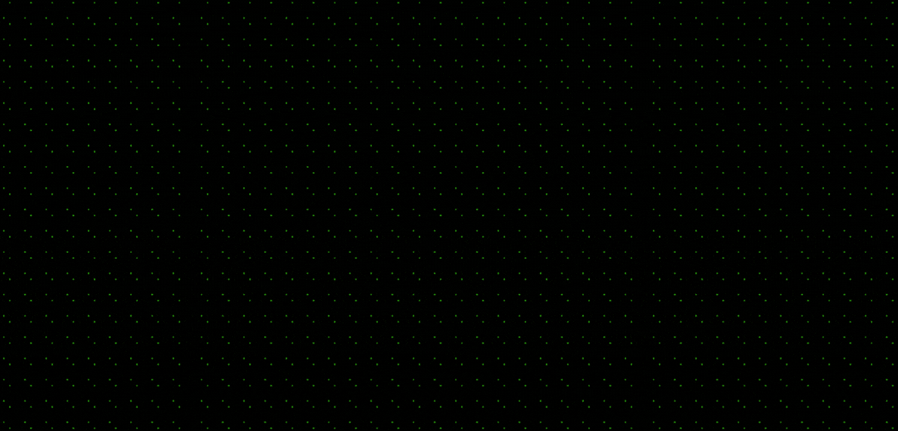

<p align="center">

  

</p>

---

<h1 align="center">QRMaker - JavaScript QR Code-Creation Module</h1>

## Introduction
QRMaker is a node module integratable in JavaScript for anybody to be able to create programs with the ability to generate QR codes.

## Module
To install QRMaker, run this command using `npm` ([Node JS](https://nodejs.org/) Package Manager):
```shell
npm install qrmaker
```

## Intergrations
After installing the module, initialize the class `QRCode` to create one. Here is an example using HTML and JavaScript:
**HTML**:
```
<!DOCTYPE html>
<html lang="en">
<head>
    <meta charset="UTF-8">
    <meta name="viewport" content="width=device-width, initial-scale=1.0">
    <title>QRCode Testing</title>
    <script src="./script.js"></script>
</head>
<body>

    
    
</body>
</html>
```

**JavaScript**:
```javascript
const qrmaker = require('qrmaker');

function generateQRCode(data, containerId) {
  var qrcode = new qrmaker.QRCode(0, QRCode.ErrorCorrectLevel.L);
  qrcode.addData(data);
  qrcode.make();

  var container = document.getElementById(containerId);

  var qrCodeElement = qrcode.createImgTag(4, 0);

  container.innerHTML = qrCodeElement;
}

document.addEventListener("DOMContentLoaded", function () {
  var dataToEncode = "https://www.example.com";
  var containerId = "qrcode-container";

  generateQRCode(dataToEncode, containerId);
});
```

Now you can create a QR code by changing the link to the target URL of your choice.

> *This module is completely free-to-use by anybody to integrate the amazing and magical ability of QR codes to anything*

## &copy; Copyright Voltra Incorporation. All rights reserved.
